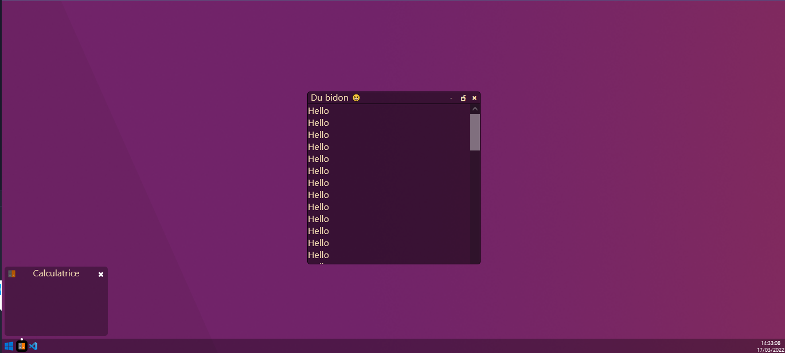
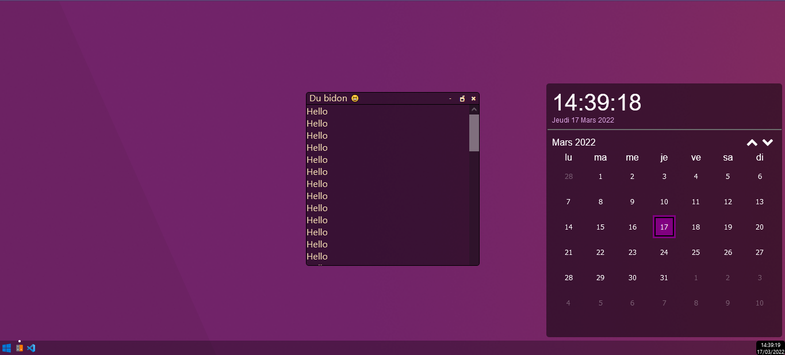

# react-web-os
création d'un WebOS avec un design complètement custom mais avec une inspiration du design de Windows 11 en ReactJS




# Démo
 - [https://webos.react.nicolaschoquet.fr](https://webos.react.nicolaschoquet.fr)
 - [https://sb.webos.react.nicolaschoquet.fr](https://sb.webos.react.nicolaschoquet.fr)

# Get started

## Install
```shell
npm install
```
or
```shell
yarn install
```
or
```shell
pnpm run install
```

## Start project
```shell
npm run dev
```
or
```shell
yarn dev
```
or
```shell
pnpm run dev
```

## Start StoryBook
```shell
npm run storybook
```
or
```shell
yarn storybook
```
or
```shell
pnpm run storybook
```

# ANNEXES
- JavaScript
    - https://www.designcise.com/web/tutorial/how-to-disconnect-a-websocket-connection-in-javascript
- Golang
    - https://gowebexamples.com/websockets/
https://gobyexample.com/environment-variables
- Github Actions
    - Pour vérifier la validité de la conf github actions
     - https://rhysd.github.io/actionlint/
